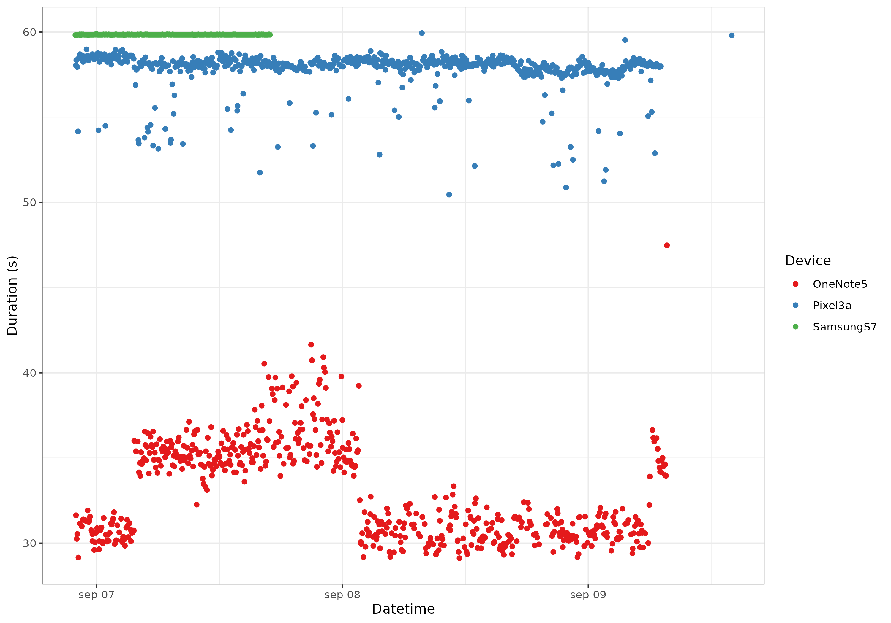

# Recording Audio in the wild using repurposed Android devices

This is the result of trying out three devices to record audio in the wild. The devices are Samsung Galaxy S7, OneNote 5, and Google Pixel 3a. The intended duration was 60 seconds, but the actual duration varied between the devices. Nevertheless, the recordings were usable for the intended purpose of bioacoustics analysis.

# Installation Tutorial

## SSH access

1. Enable developer mode in System settings, about, enable developer mode. 

2. Check IP in WiFi -> click on network name to display info -> ip

### Start ssh service at boot

Run the following command to enable ssh service at boot:
`sudo systemctl enable ssh`

Now reboot the device.

### Enable ssh access from a specific machine

Here's a general approach to how you might do this:
1. Generate SSH Key Pair on Your Computer: If you haven't already, generate an SSH key pair on your local machine using the following command:
`ssh-keygen -t rsa -b 2048`

2. Display Your Public Key: Display your public key on your local machine with:

`cat ~/.ssh/id_rsa.pub`

3. Copy the output, which is your public key.

4. Access the Device Directly: Access the terminal on the Ubuntu Touch device directly. You might need to do this physically on the device.

5. Create SSH Directory and Authorized Keys File: On the Ubuntu Touch device, create the .ssh directory and the authorized_keys file (if they don't already exist) with:

`mkdir -p ~/.ssh`

`touch ~/.ssh/authorized_keys`

6. Edit Authorized Keys File: Open the authorized_keys file in a text editor on the device, like nano or vi, and paste your public key into the file and enter the key. Save and exit the editor. For example:

`nano ~/.ssh/authorized_keys`

**Probably this is more simple:** You can also scp the key from your computer into your ubuntu touch device, by typing the right scp command on your ubuntu touch device. For example:

`scp pc_user@IP_ADDRESS:~/.ssh/id_rsa.pub ~/.ssh/authorized_keys` (from your ubuntu touch device)

7. Set Correct Permissions: Set the correct permissions for the .ssh directory and the authorized_keys file with:

`chmod 700 ~/.ssh`

`chmod 600 ~/.ssh/authorized_keys`

8. Try Connecting Again: Try connecting again from your local machine with:

`ssh phablet@IP_ADDRESS`

You can print the ubuntu touch device's model with `cat /proc/device-tree/model` or `cat /etc/writable/machine-info`

## Make device ID file

Save something like "Samsung Galaxy S7" to a file on the device. This will be used to identify the device.

`nano ~/pam_device_ID`

## copy bash script to device

`scp ./pam_recorder.sh phablet@IP_ADDRESS:~/Documents`

Ensure it is executable by running `chmod +x ~/Documents/pam_recorder.sh`

## Unlock whole system write access

Ubuntu touch is by default read only. To unlock write access, run the following command:

`sudo mount -o remount,rw /`

## Install dependencies

`sudo apt update && sudo apt install -y sox file cron htop` #htop is optional

## Set up cron job

Make sure the directory `~/Documents/pam_output` exists. If not, create it by running `mkdir ~/Documents/pam_output`

Then, edit the crontab file by running

`crontab -e`

And add the following line to the end of the file:

*/2 * * * * /home/phablet/Documents/pam_recorder.sh >> /home/phablet/Documents/pam_output/cron.log 2>&1

Then restart the device, and next time it boots it should be recording audio every even minute for a minute.

# Debug

If the recording time is wrong, for example if it is delayed by a significant amount of time (>3seconds), probably it is because the device is running multiple instances of the cron job. To check this, run `systemctl status cron`, the output should be as this: